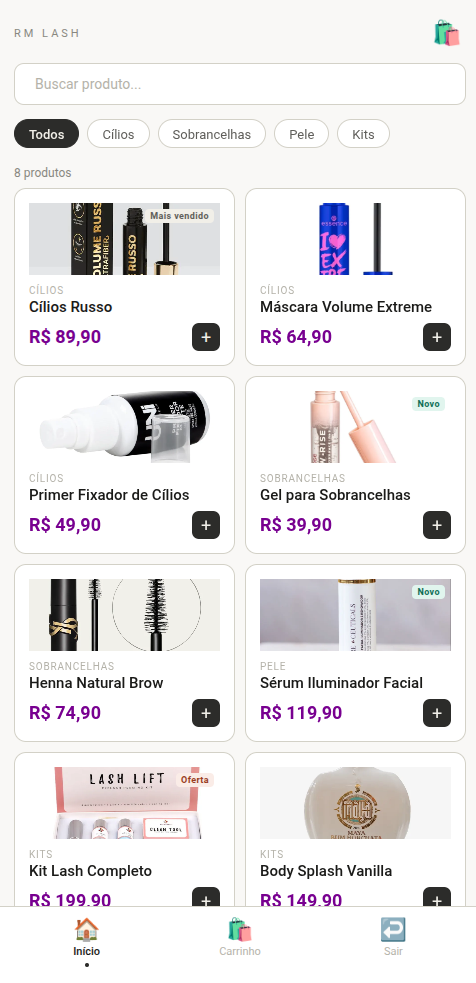
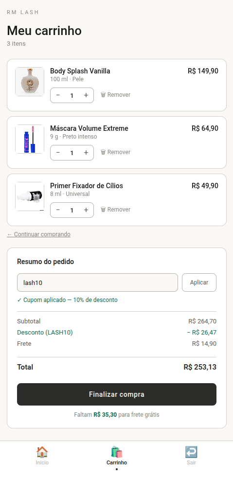

# Projeto Extensão - Aplicativo Mobile para Gestão de Estoque para Loja de Cosméticos

Aplicativo desenvolvido em **React Native** utilizando **Expo** como parte de um Projeto de Extensão Universitária.

O sistema foi criado para auxiliar pequenos empreendedores e lojas do ramo de cosméticos no gerenciamento de produtos, proporcionando uma solução simples, acessível e intuitiva para o controle de estoque através de dispositivos móveis.

---

## Objetivo

Desenvolver uma aplicação mobile que facilite o gerenciamento de produtos e estoques de lojas de cosméticos, contribuindo para a organização dos processos internos e para a melhoria da gestão comercial.

---

## Funcionalidades

- Cadastro de produtos
- Pesquisa de produtos
- Visualização do estoque
- Interface otimizada para dispositivos móveis
- Navegação intuitiva entre telas
- Organização modular do projeto
- Experiência rápida e responsiva

---

## Tecnologias Utilizadas

### Front-end

- React Native
- Expo
- TypeScript

### Navegação

- React Navigation
  - Native Stack Navigation
  - Bottom Tabs Navigation

### Recursos Adicionais

- React Native Reanimated
- React Native Gesture Handler
- React Native Screens
- React Native Safe Area Context
- React Native Text Ticker

---

## Estrutura do Projeto

```text
projeto-ext/
│
├── src/
│   ├── components/
│   ├── screens/
│   ├── navigation/
│   ├── assets/
│   ├── dao/
│   └── controllers/
│
├── App.js
├── package.json
├── tsconfig.json
└── README.md
```

---

## Instalação

### Clone o repositório

```bash
git clone https://github.com/vinicarddoso/projeto-ext.git
```

### Acesse a pasta do projeto

```bash
cd projeto-ext
```

### Instale as dependências

```bash
npm install
```

### Execute o projeto

```bash
npm start
```

ou

```bash
npx expo start
```

---

## Executando no Android

```bash
npm run android
```

## Executando no iOS

```bash
npm run ios
```

## Executando na Web

```bash
npm run web
```

---

## 👨‍💻 Equipe

Projeto desenvolvido por estudantes da disciplina de Programação para Dispositivos Móveis como atividade de extensão universitária.

### Integrantes

- Vinícius Cardoso Miranda // @vinicarddoso
- Luiz Felipe Guedes Rodrigues // @felipeguedes0410

---

## Impacto Sociocomunitário

O projeto busca contribuir com pequenos empreendedores do setor de cosméticos, oferecendo uma ferramenta digital que auxilia na organização de produtos e no controle de estoque, reduzindo erros operacionais e melhorando a eficiência da gestão.

---

## 📸 Demonstração

| Tela Inicial | Carrinho de compras |
|-------------|------------------|
|

<p align="center">
  
  
</p>

---

## Licença

Este projeto foi desenvolvido para fins acadêmicos e educacionais.

---
